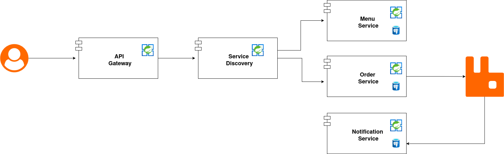

# spring-microservices-eureka
This is a demo application for a restaurant that will be developed using domain driven design, clean architecture and microservices.
We will use rabbit mq for our asynchronous communication and leverage virtual threads for performance.

 

## modules
* **menu-service**:
  This services provides REST API for managing the menu of a restaurant.

  **TechStack:** Spring Boot, Spring Data JPA, PostgreSQL

* **order-service**:
  This service provides the REST API for ordering food and publishes order events to the message broker.

  **TechStack:** Spring Boot, Spring Data JPA, PostgreSQL, RabbitMQ

* **notification-service**:
  This service listens to the order events and sends notifications to the kitchen.

  **TechStack:** Spring Boot, RabbitMQ

* **api-gateway**:
  This service is an API Gateway to the internal backend services (menu-service, order-service).

  **TechStack:** Spring Boot, Spring Cloud Gateway

* **service-discovery**:
  This service will be the register of our microservices, will also serve a load balancer between ours instances.

  **TechStack:** Netflix eureka

### prerequisites

Make sure you have the following software installed:

- **Java Development Kit (JDK)**: Version 24 or higher
- **Apache Maven**: Build automation tool for managing dependencies and building the application
- **Docker**: Platform for developing, shipping, and running applications in containers (required for PostgreSQL)
- **Task**: Simple task runner for managing the Docker container lifecycle ([installation instructions](https://taskfile.dev))

### starting the infrastructure

The project uses Docker Compose for managing infrastructure components like PostgreSQL and RabbitMQ. 
To start the infrastructure, navigate to the infra/docker-compose directory and run:

```bash
task start_infra
```

### running the application

1. **Start the Service Discovery**:
   Navigate to the `discovery-service` directory and run:
   ```bash
   ./mvnw spring-boot:run
    ```
   
2. **Start the Menu Service**:
   Navigate to the `menu-service` directory and run:
   ```bash
   ./mvnw spring-boot:run
    ```
3. **Start the Api Gateway**:
   Navigate to the `api-gateway` directory and run:
   ```bash
   ./mvnw spring-boot:run
    ```


- **Eureka Dashboard:** [http://localhost:8761](http://localhost:8761)
- **API Gateway:** [http://localhost:8989](http://localhost:8989)
- **Swagger UI:** [http://localhost:8989/swagger-ui.html](http://localhost:8989/swagger-ui.html)

